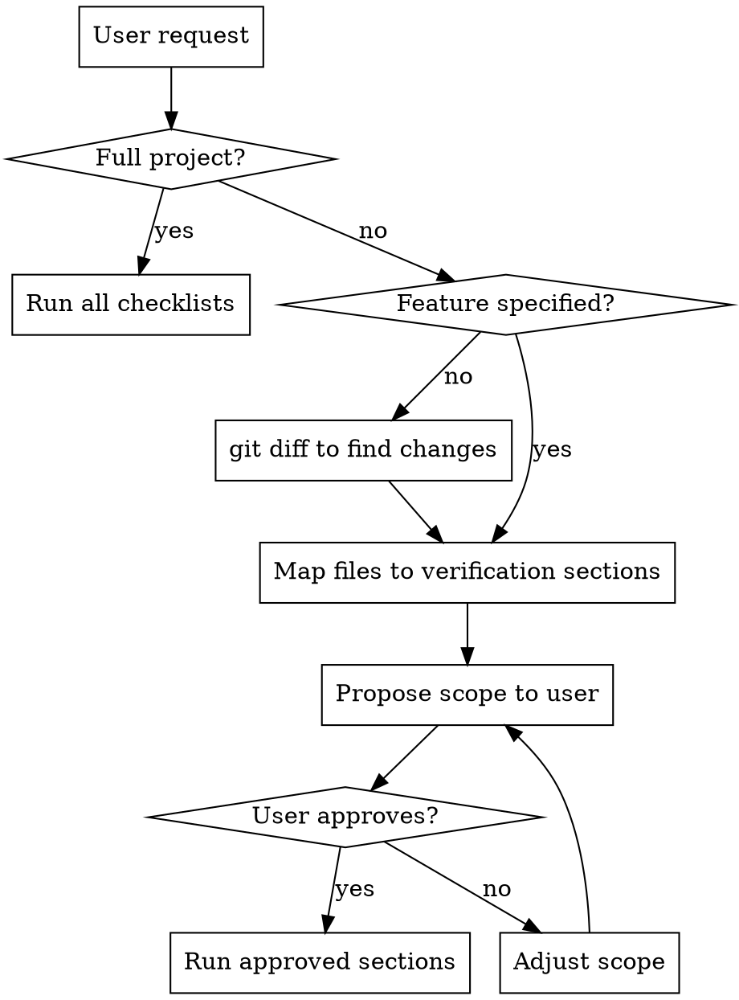
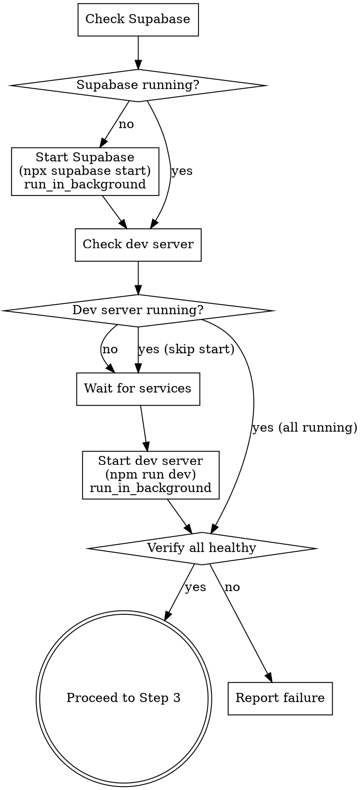
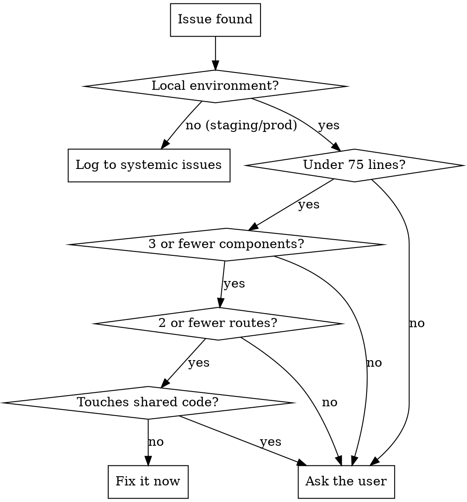

# Browser Verification

## Overview

Automated manual QA using browser tools against verification checklists in `docs/verification/`. Walks through every checklist item in a real browser, explores full CRUD on each page, finds issues, fixes what's safe, and logs everything.

**Core principle:** Verify in the browser, not in your head. Evidence from the DOM, console, and network — not assumptions.

## When to Use

- Pre-deploy QA for staging or production
- After implementing a feature — verify it and tangential features
- Full regression run across all roles
- When user says "verify", "test in browser", "manual QA", or "check the UI"

## Checklist

You MUST complete these in order:

1. **Determine scope**
2. **Detect environment**
3. **Load verification docs**
4. **Run verification sections**
5. **Fix or log issues**
6. **Produce log file and summary**

## Step 1: Determine Scope

Ask the user or infer from context:



**File-to-section mapping:** Match changed file paths to verification docs:
- `app/admin/*` -> `docs/verification/admin.md`
- `app/educator/*` or `app/(educator)/*` -> `docs/verification/educator.md`
- `app/employer/*` or `app/(employer)/*` -> `docs/verification/employer.md`
- `app/student/*` or `app/(student)/*` -> `docs/verification/student.md`
- `app/guardian/*` or `app/(guardian)/*` -> `docs/verification/guardian.md`
- `app/community-center/*` -> `docs/verification/community-center.md`
- `components/*`, `hooks/*`, `lib/*`, `middleware*` -> `docs/verification/shared.md` + all role docs that import the changed file
- `app/api/*` -> Check which UI features call that API, verify those sections

**Tangential detection:** When a changed file is imported by other features, include those features in scope. Use grep/glob to trace imports.

## Step 2: Detect Environment and Start Services

Determine from the base URL:

| Signal | Environment | Login Method | Fix Policy |
|---|---|---|---|
| `localhost` or `127.0.0.1` | Local | Auto via Inbucket | Fix within thresholds |
| Any other URL | Staging/Production | Pause for manual login | Log only, never fix |

**Local environment: auto-start services**

For local environments, automatically start required services rather than asking the user. Run these checks and start anything that's missing:



1. **Check Supabase** (`curl -s -o /dev/null -w "%{http_code}" http://localhost:54421/rest/v1/`):
   - If not running, start it: `npx supabase start` (use `run_in_background`). Wait for it to be healthy before proceeding. Supabase provides the local database (port 54422) and Inbucket email (port 54424).
2. **Check Inbucket** (`curl -s -o /dev/null -w "%{http_code}" http://localhost:54424`):
   - Inbucket comes up with Supabase. If Supabase is running but Inbucket isn't, something is wrong — report the error.
3. **Check dev server** (`curl -s -o /dev/null -w "%{http_code}" http://localhost:3333`):
   - If not running, start it: `npm run dev` (use `run_in_background`). The dev server serves on port 3333.
   - Wait up to 30 seconds for the server to respond to requests before proceeding.
4. **Verify all healthy**: Confirm all three endpoints respond (dev server 3333, Supabase API 54421, Inbucket 54424). If any fail after startup, report what failed and stop.

**Monitor background services during verification:** If the dev server or Supabase crashes during verification (network requests start failing, pages return 500s), check the background task output and report the error rather than logging false failures.

**Staging/Production:** Do NOT start any services. Only verify the target URL is reachable. If not, tell the user and wait.

## Step 3: Load Verification Docs

1. Read `docs/verification/index.md` for prerequisites and login credentials
2. Read each verification doc in scope
3. Parse checklist items — format: `- [ ] **Action** --- Expected result. *Requires: preconditions.*`
4. Note required login credentials per section

## Step 4: Run Verification Sections

**Browser tool priority:** Use Chrome MCP (`mcp__claude-in-chrome__*`) as primary. Fall back to Playwright (`mcp__playwright__*`) if Chrome fails on a specific interaction.

**For each section:**

### 4a. Login

**Local:** Automate the magic link flow:
1. Navigate to login page
2. Enter the role's email address and click Send Magic Link
3. Retrieve the magic link from Mailpit API (`GET /api/v1/messages`, then `GET /api/v1/message/{id}` and extract the verify URL from the HTML body). Decode `&amp;` to `&` in the extracted URL.
4. Navigate to the magic link URL using `page.evaluate(() => { window.location.href = url })` — **do NOT use `page.goto()`** for Supabase auth verify URLs because the 303 redirect causes Playwright to throw `ERR_HTTP_RESPONSE_CODE_FAILURE`. The `window.location.href` approach lets the browser handle the redirect chain naturally.
5. Wait 10-12 seconds for redirects to complete (auth callback → dashboard)
6. Confirm redirect to the correct dashboard by checking `page.url()`

**To switch roles:** Clear cookies with `page.context().clearCookies()`, clear Mailpit messages with `DELETE /api/v1/messages`, then repeat the flow above.

**Mailpit API (not Inbucket):** The local Supabase instance uses Mailpit at port 54424, NOT Inbucket. The API is:
- `GET /api/v1/messages` — list messages (returns `{ messages: [...] }`)
- `GET /api/v1/message/{id}` — get message with HTML body
- `DELETE /api/v1/messages` — delete all messages

**Staging/Production:** Tell the user which role/email to log in as. Wait for confirmation before proceeding.

### 4b. Walk the Checklist

For each checklist item:
1. Perform the action described
2. Check if the expected result matches what's in the browser
3. Check console for errors (`mcp__claude-in-chrome__read_console_messages` or `mcp__playwright__browser_console_messages`)
4. Check network for failed requests (`mcp__claude-in-chrome__read_network_requests` or `mcp__playwright__browser_network_requests`)
5. Record result: PASS, FAIL (with details), or BLOCKED (precondition not met)

### 4c. Explore Beyond the Checklist

After completing listed items, explore the page for untested functionality:
- Click every button and link on the page
- Try edge cases: empty forms, special characters, very long input
- Check responsive behavior if relevant
- Look for UI inconsistencies, broken layouts, missing states
- Note any functionality not covered by the checklist (for proposed additions)

### 4d. Record Results

Track per item:
- Status: PASS | FAIL | FIXED | SYSTEMIC | BLOCKED
- For FAIL: What actually happened vs. what was expected
- Console errors encountered during this item
- Network errors encountered during this item
- Screenshots if useful (use `mcp__playwright__browser_take_screenshot`)

## Step 5: Fix or Log Issues

After completing ALL items in a section, process failures:



**Fix thresholds (local only) — ALL must be true:**
- < 75 lines of changes
- Isolated to <= 3 components
- Isolated to <= 2 routes
- Does NOT touch shared code (shared components, utilities, middleware, hooks used across features)

**When fixing:**
1. Fix the code
2. Update tests if the fix changes tested behavior
3. Update verification docs if the fix changes expected behavior
4. Re-verify the fixed item in the browser
5. Log the fix in the "Fixes Applied" section of the run log

**When logging systemic issues:**
- Describe the issue and what's broken
- List affected areas
- Explain why it can't be fixed inline
- Suggest an approach for resolution

## Step 6: Produce Log File and Summary

### Log File

Write to `docs/verification/logs/YYYY-MM-DD-verification-run.md`:

```markdown
# Verification Run - YYYY-MM-DD

## Summary
- Scope: [full | feature + tangential]
- Environment: [local | staging | production]
- Sections run: X
- Items checked: X
- Passed: X | Failed: X | Fixed: X | Logged (systemic): X

## Section Results
### [Role - Section Name]
- [PASS] Item description
- [FAIL] Item description - what happened
- [FIXED] Item description - what was wrong, what was changed
- [SYSTEMIC] Item description - why this needs broader discussion

## Console/Network Errors
- [route] error description

## Fixes Applied
### Fix: [description]
- Files changed: ...
- Lines changed: X
- Tests updated: [yes/no]
- Docs updated: [yes/no]

## Systemic Issues
### Issue: [description]
- Affected areas: ...
- Why it can't be fixed inline: ...
- Suggested approach: ...

## Proposed Verification Doc Additions
### [filename] - [Section Name]
- [ ] **Proposed new item** --- Expected result.
```

### Terminal Summary

Print a concise summary:
```
Verification complete. Log: docs/verification/logs/YYYY-MM-DD-verification-run.md

Results: X passed | X failed | X fixed | X systemic
Fixes applied: [list of short descriptions]
Systemic issues: [list of short descriptions]
Proposed doc additions: X new items across Y files (see log for details)
```

## Common Mistakes

| Mistake | Prevention |
|---|---|
| Asking user to start services locally | Auto-start Supabase and dev server in background; only ask if startup fails |
| Using `page.goto()` for Supabase auth verify URLs | Use `page.evaluate(() => { window.location.href = url })` instead — Playwright throws on 303 redirects |
| All pages returning 500 after `.next` corruption | Kill dev server, run `npm run dev` again — the routes-manifest rebuilds on restart |
| Skipping console/network checks | Check BOTH after every checklist item |
| Fixing on staging/production | ALWAYS check environment before fixing |
| Fixing shared code without asking | Trace imports — if file is used outside the current feature, ask |
| Not re-verifying after fix | Re-run the failed item after every fix |
| Missing tangential features | Grep for imports of changed files to find affected features |
| Trusting the checklist is complete | Explore beyond listed items on every page |
| Proceeding without login confirmation | On staging/prod, always wait for user to confirm login |

## Red Flags - STOP

- About to edit code on staging/production run
- Fix touches more than 3 components or 2 routes
- Fix exceeds 75 lines
- Changed file is imported by many features (shared code)
- Console shows auth/session errors (may indicate environment issue, not code bug)
- Multiple failures in the same section suggest a systemic issue — consider logging instead of fixing individually
