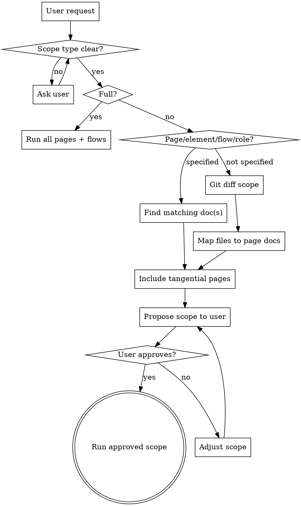
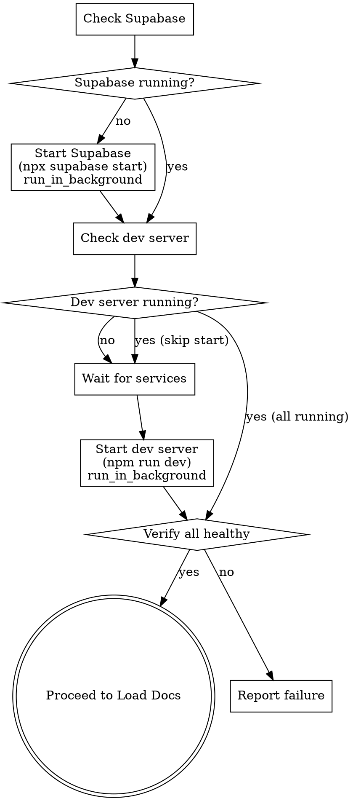
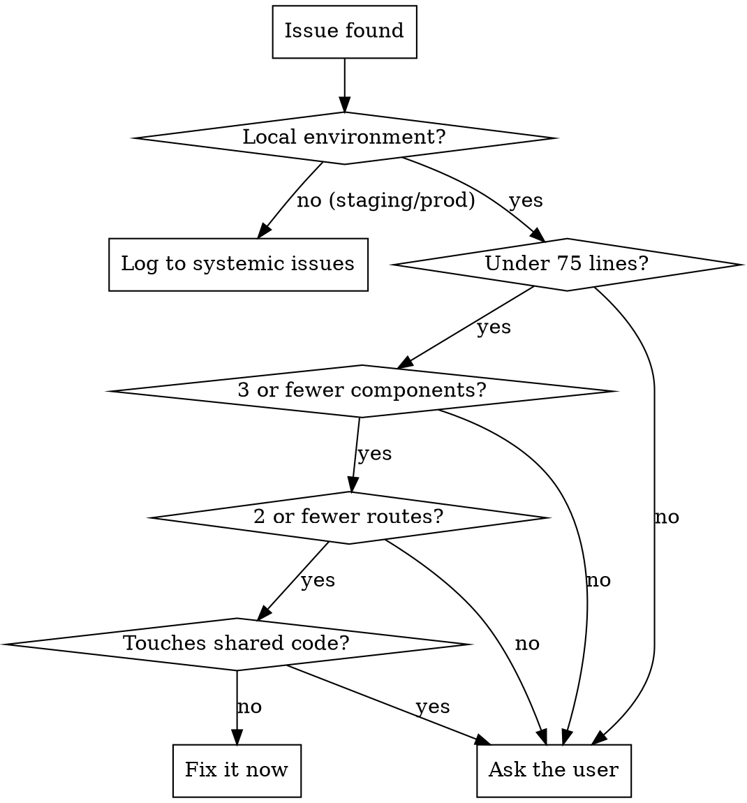

# Browser Verification

## Overview

Automated manual QA using browser tools against verification checklists in `docs/verification/`. Walks through every checklist item in a real browser, explores full CRUD on each page, finds issues, fixes what's safe, and logs everything.

**Core principle:** Verify in the browser, not in your head. Evidence from the DOM, console, and network — not assumptions.

**Graceful failure standard:** A feature is not PASS if it works on the happy path but fails ungracefully on any error path. "Works but crashes ugly" is FAIL. Every interaction has a happy path and failure paths — both must behave well. If a checklist item has an `*Expected:*` type, that tells you what kind of outcome to verify. If an item has no explicit error path items nearby, test basic error scenarios anyway (empty input, network failure at deep depth) and flag missing coverage.

**Companion skill:** Verification docs are generated and maintained by the **verification-writer** skill. If you find docs are stale, missing, or incomplete during a run, invoke verification-writer to update them (see "Cross-Skill Integration" below).

## Verification Depth

This skill operates at three depth levels. **Ask the user which depth they want** if not specified. Default to **standard** if they don't have a preference.

| Depth | When to use | What it does |
|---|---|---|
| **Smoke** | Quick sanity check, CI gate, "does it load?" | Load every page in scope, check for render errors, console errors, and failed network requests. No interaction testing. |
| **Standard** | Post-feature verification, routine QA | Walk every checklist item, check console + network per item, basic exploration of uncovered elements. |
| **Deep** | Pre-deploy to production, regression after major refactor, "test everything" | Full completionist audit: every interactive element tested, every form with edge cases, server logs, CRUD round-trips, accessibility checks. Nothing skipped. |

**Keyword detection:** If the user says "quick check", "smoke test", "does it load", or "sanity check" → **smoke**. If they say "verify", "check the feature", or "QA" → **standard**. If they say "deep", "thorough", "everything", "full audit", "fine-toothed comb", "diligent", "production readiness", or "test everything" → **deep**.

**When deep is selected:** Before starting, ask the user clarifying questions about: test data creation preferences (create new vs. use existing), specific user accounts to use, any areas of particular concern, and any preconditions they've already set up (e.g., "I just logged in as admin"). This front-loads alignment and prevents wasted runs.

## When to Use

- Pre-deploy QA for staging or production
- After implementing a feature — verify it and tangential features
- Full regression run across all roles
- When user says "verify", "test in browser", "manual QA", or "check the UI"

## Checklist

You MUST complete these in order:

1. **Find verification docs**
2. **Determine scope and depth**
3. **Detect environment**
4. **Load verification docs**
5. **Run verification sections**
6. **Fix or log issues**
7. **Update stale docs** (invoke verification-writer if needed)
8. **Produce log file and summary**

## Step 1: Find Verification Docs

Before anything else, locate the verification docs for this project.

1. **Check memory** for a `verification-docs-config` project memory. This tells you the doc location, organization, and preferences set by verification-writer.
2. **If memory exists:** Verify the path still has docs (files may have been deleted). If docs exist at the path, proceed to Step 2.
3. **If memory exists but docs are missing at the path:** Tell the user:
   > "Memory says verification docs should be at `<path>`, but they're not there. Run `/verification-writer` to generate them, or tell me the correct location."
4. **If no memory exists:** Check `docs/verification/` as a default. If docs exist there, use them and note the location. If nothing exists anywhere, tell the user:
   > "No verification docs found for this project. Run `/verification-writer` to generate them first — it will analyze the codebase and create verification checklists."

   Do not proceed without docs. There is nothing to verify against.

## Step 2: Determine Scope and Depth

Ask the user or infer from context. You need two things: **scope** and **depth** (smoke, standard, or deep). If the user only specifies one, ask for the other or use defaults (standard depth, git-diff-based scope).

### Scope types

Verification docs support four scope types. Determine which applies from the user's request:

| User says | Scope type | What to run |
|---|---|---|
| "verify the event detail page" | **Page** | Open `pages/event-detail.md`, run all user type sections (or a specific one if they specify a role) |
| "verify the countdown timer on event detail" | **Element** | Open `pages/event-detail.md`, find items related to the timer (search by element name, item ID, or `BUSINESS-CONTEXT` annotations) |
| "verify the event lifecycle flow" | **Flow** | Open `flows/event-lifecycle.md`, run steps in order, switching user types as the flow directs |
| "verify everything the promoter sees" | **User type** | Read `index.md` user type matrix, run all page files and flows that include the Promoter role (Promoter sections only) |
| "verify everything" | **Full** | Run all page files (all sections) + all flow files |
| "verify what I changed" | **Git diff** | Map changed files to page files (see mapping below), propose scope |

### Scope from user request



### Running a page scope

Open the page file. Determine which user type sections to run:
- If the user specified a role ("verify event detail as admin"), run only that role's section + the "All User Types" section.
- If no role specified, run all sections. Switch login/auth between sections as needed.
- For each section, run items filtered by depth (smoke items at all depths, standard at standard+deep, deep only at deep).

### Running an element scope

Open the page file and find items related to the requested element. Search by:
- Element name in item text ("countdown timer", "delete button", "artist dropdown")
- `BUSINESS-CONTEXT` annotations that mention the element
- Item IDs if the user provides them

Run only the matching items across all user type sections (the element may behave differently per role). If the element has `BUSINESS-CONTEXT` annotations, read them before interacting.

### Running a flow scope

Open the flow file. Run steps in the order defined:
1. Read the flow's prerequisites and set up any required state
2. For each step: switch to the specified user type, navigate to the specified page, run the listed items
3. After each step: run the "After this step" checks (cross-step state verification, data integrity)
4. After all steps: verify the end-to-end expectations

Flow runs are always at least standard depth. If the user requests smoke, warn that flows test cross-page interactions which require interaction (not just page loads), and suggest standard instead.

### Running a user type scope

Read `index.md` to find all page files and flows that include the specified user type. Run only that role's sections in each page file. For flows that involve the role, run the full flow (all steps, all roles) since flows test cross-role interaction — but note which steps are the focus role's steps.

### Git diff scope mapping

Map changed source files to page verification files:
- `app/**/page.tsx`, `app/**/layout.tsx` → find the page file covering that route
- `components/*` → find page files whose items test UI that uses the component (grep page files for the component name or check `shared.md`)
- `hooks/*`, `lib/*`, `utils/*` → trace imports to find which pages use them, map to those page files
- `middleware*` → `shared.md` + all page files
- `app/api/*` → find page files whose items interact with that API endpoint (search `BUSINESS-CONTEXT` annotations and item descriptions)

**Tangential detection:** When a changed file is imported by other pages, include those page files in scope. Use grep/glob to trace imports. Also check flow files — if a changed page participates in a flow, propose running the flow too.

## Step 2: Detect Environment and Start Services

Determine from the base URL:

| Signal | Environment | Login Method | Fix Policy |
|---|---|---|---|
| `localhost` or `127.0.0.1` | Local | Auto via Inbucket | Fix within thresholds |
| Any other URL | Staging/Production | Pause for manual login | Log only, never fix |

**Local environment: auto-start services**

For local environments, automatically start required services rather than asking the user. Run these checks and start anything that's missing:



1. **Check Supabase** (`curl -s -o /dev/null -w "%{http_code}" http://localhost:54421/rest/v1/`):
   - If not running, start it: `npx supabase start` (use `run_in_background`). Wait for it to be healthy before proceeding. Supabase provides the local database (port 54422) and Inbucket email (port 54424).
2. **Check Inbucket** (`curl -s -o /dev/null -w "%{http_code}" http://localhost:54424`):
   - Inbucket comes up with Supabase. If Supabase is running but Inbucket isn't, something is wrong — report the error.
3. **Check dev server** (`curl -s -o /dev/null -w "%{http_code}" http://localhost:3333`):
   - If not running, start it: `npm run dev` (use `run_in_background`). The dev server serves on port 3333.
   - Wait up to 30 seconds for the server to respond to requests before proceeding.
4. **Verify all healthy**: Confirm all three endpoints respond (dev server 3333, Supabase API 54421, Inbucket 54424). If any fail after startup, report what failed and stop.

**Monitor background services during verification:** If the dev server or Supabase crashes during verification (network requests start failing, pages return 500s), check the background task output and report the error rather than logging false failures.

**Staging/Production:** Do NOT start any services. Only verify the target URL is reachable. If not, tell the user and wait.

## Step 3: Load Verification Docs

1. Read `<verification-path>/index.md` for prerequisites, login credentials, and the page/flow/user-type inventory
2. Based on scope type determined in Step 2:
   - **Page scope:** Read the page file(s) in `pages/`
   - **Element scope:** Read the page file, locate items for the specific element
   - **Flow scope:** Read the flow file in `flows/`, then read each page file referenced by the flow steps
   - **User type scope:** Read the user type matrix in `index.md`, then read all page files and flow files listed for that role
   - **Full scope:** Read all page files and all flow files
3. Parse checklist items — format: `- [ ] [depth] **Action** --- Expected result. *Expected: type*`
4. **Filter by depth:** Only run items tagged with the current depth or lower (smoke < standard < deep). Smoke items run at all depths; deep items only run at deep depth.
5. Note the `*Expected: type*` on each item — this tells you what kind of outcome to verify:
   - `success` — happy path works
   - `warning dialog` — warned before destructive action
   - `client-side validation error` — bad input caught before server
   - `graceful server error` — server rejects, UI handles gracefully
   - `auth boundary enforcement` — access control works
   - `success with side effects` — works AND downstream effects happen
   - `graceful empty state` — no-data scenario handled appropriately
6. Note required login credentials per section
7. **Parse `<!-- BUSINESS-CONTEXT -->` annotations** on items that verify dynamic/computed values. These annotations provide:
   - `rule:` — the business logic and code source that determines the expected value
   - `valid_range:` — bounds and constraints the displayed value must satisfy
   - `cross_reference:` — other values on the same page that should be consistent
   - `red_flags:` — specific symptoms of data bugs and what they mean
   
   When running an item with a business context annotation, you are not just checking "does the component render" — you are checking "does the displayed value make sense given the business rule." Read the annotation before interacting with the component so you know what to look for.
8. **If no verification docs exist:** Tell the user and suggest running `/verification-writer` to generate them. Do not proceed without docs.

**Staleness detection:** As you run items, watch for signs the docs are out of date:
- Item describes UI that doesn't exist (button removed, route renamed)
- Item's expected behavior doesn't match actual behavior
- Page has interactive elements with no checklist items
- These get logged and sent to verification-writer for update (see Cross-Skill Integration)

## Step 4: Run Verification Sections

**Browser tool priority:** Use Chrome MCP (`mcp__claude-in-chrome__*`) as primary. Fall back to Playwright (`mcp__playwright__*`) if Chrome fails on a specific interaction.

**For each section:**

### 4a. Login

**Local:** Automate the magic link flow:
1. Navigate to login page
2. Enter the role's email address and click Send Magic Link
3. Retrieve the magic link from Mailpit API (`GET /api/v1/messages`, then `GET /api/v1/message/{id}` and extract the verify URL from the HTML body). Decode `&amp;` to `&` in the extracted URL.
4. Navigate to the magic link URL using `page.evaluate(() => { window.location.href = url })` — **do NOT use `page.goto()`** for Supabase auth verify URLs because the 303 redirect causes Playwright to throw `ERR_HTTP_RESPONSE_CODE_FAILURE`. The `window.location.href` approach lets the browser handle the redirect chain naturally.
5. Wait 10-12 seconds for redirects to complete (auth callback → dashboard)
6. Confirm redirect to the correct dashboard by checking `page.url()`

**To switch roles:** Clear cookies with `page.context().clearCookies()`, clear Mailpit messages with `DELETE /api/v1/messages`, then repeat the flow above.

**Mailpit API (not Inbucket):** The local Supabase instance uses Mailpit at port 54424, NOT Inbucket. The API is:
- `GET /api/v1/messages` — list messages (returns `{ messages: [...] }`)
- `GET /api/v1/message/{id}` — get message with HTML body
- `DELETE /api/v1/messages` — delete all messages

**Staging/Production:** Tell the user which role/email to log in as. Wait for confirmation before proceeding.

---

### Depth: Smoke

**Goal:** Confirm pages load without errors. No interaction testing.

**For each page in scope:**
1. Navigate to the page
2. Verify it renders (no blank screen, no error page, no 500)
3. Read console messages — flag any errors or warnings (`mcp__claude-in-chrome__read_console_messages` or `mcp__playwright__browser_console_messages`)
4. Read network requests — flag any 4xx/5xx responses (`mcp__claude-in-chrome__read_network_requests` or `mcp__playwright__browser_network_requests`)
5. Record: PASS (page loads clean), FAIL (with what broke), or BLOCKED

**Smoke does NOT include:** clicking buttons, filling forms, testing CRUD, checking server logs, or exploring beyond the page load. If you find yourself interacting with elements, you've exceeded smoke depth — stop and confirm with the user.

**Record per page:**
- Status: PASS | FAIL | BLOCKED
- Console errors (list each one, or "none observed")
- Network errors (list each one, or "none observed")
- Screenshot if FAIL

---

### Depth: Standard

**Goal:** Walk every checklist item and verify it works with evidence.

**4b. Walk the Checklist**

For each checklist item:
1. Perform the action described
2. Check if the expected result matches what's in the browser
3. Read console messages after the action — flag errors and warnings
4. Read network requests after the action — flag 4xx/5xx and slow requests (> 2s)
5. Record result: PASS, FAIL (with details), or BLOCKED (precondition not met)

**A checklist item is not PASS unless you have evidence from the DOM, console, AND network that it works.** "It looked right" is not evidence.

**4c. Basic Exploration**

After completing the checklist for a page, do a quick scan for obvious gaps:
- Are there interactive elements on the page that no checklist item covered?
- If yes, test the most important ones (primary actions, navigation, forms)
- Note any functionality not covered by the checklist — propose additions to verification docs

**Record per item:**
- Status: PASS | FAIL | FIXED | SYSTEMIC | BLOCKED
- For FAIL: What actually happened vs. what was expected
- Console errors (list each one — "none observed" is valid, "not checked" is NOT)
- Network errors (list each one — "none observed" is valid, "not checked" is NOT)
- Screenshots if useful

---

### Depth: Deep

**Goal:** Completionist audit. Every element, every edge case, every log source. Nothing is assumed to work.

**Mindset:** Deep verification is not "standard but more." It is a fundamentally different disposition. You are a QA auditor with unlimited time and a mandate to find every problem. Approach every page as if it is hiding bugs from you — because it probably is.

- **Thoroughness over speed.** Do not optimize for token efficiency or wall-clock time. The user has explicitly chosen deep because they want exhaustive coverage. Take your time.
- **Every action, every page.** If an element exists on the page, you interact with it. If a form exists, you submit it empty, with valid data, and with edge cases. No skipping.
- **Diligence over assumptions.** Do not assume something works because a similar thing worked on another page. Verify independently. Do not assume console is clean because it was clean on the last page. Check it.
- **Status awareness.** Pay attention to field states (disabled, readonly, required, pre-populated), error messages already on the page, existing console errors, and existing network failures BEFORE you start interacting. The page state when you arrive is evidence.
- **Ask questions first.** If the verification docs are ambiguous, if you're unsure whether to create test data or use existing data, if a precondition is unclear — ask the user before proceeding. Wrong assumptions waste more time than a question.
- **Log everything.** Every interaction gets a result. Every console check gets recorded. Every network check gets recorded. "Not checked" is never acceptable at deep depth — only "none observed" or a specific finding.

**4b. Per-Page Deep Audit (MANDATORY for every page visited)**

**This audit runs on EVERY page you navigate to, whether it's part of a checklist item or not.** Loading a page without completing this audit is a skill violation.

**Visual inspection:**
1. Read the full page content — every heading, label, paragraph, tooltip, badge, and status indicator
2. Identify every interactive element: buttons, links, dropdowns, toggles, tabs, form fields, modals, accordions, pagination, sort controls
3. Check for visual defects: broken layouts, overlapping elements, truncated text, missing images, incorrect spacing, inconsistent styling
4. Verify empty states, loading states, and error states render correctly where applicable

**Affordance inspection — does the UI keep its visual promises?**
5. Identify elements with visual affordances that imply specific interactions: dashed/dotted borders (drag-and-drop), grip handles (reorder), cursor pointer on non-link elements (clickable), hover lift effects on cards (clickable/expandable), resize handles (resizable)
6. For each affordance found, test the *implied* interaction — not just the obvious fallback. If a file upload area has drop-zone styling, drag a file onto it. If cards have hover effects, click the card body (not just the action button). If list items have grip handles, attempt to drag-reorder.
7. Record: does the implied interaction work, or does only the fallback work? A drop zone where only the button works is a FAIL on the drag-and-drop item, even if upload via button passes.

**Contextual coherence — does every element belong on this page?**
8. Determine the page's purpose (information display, data entry, public marketing, admin management, etc.) and its audience (public visitor, specific user role, admin)
9. For each significant element (buttons, action links, data sections, toolbars), ask: "Does this serve this page's purpose?" and "Should this page's audience see this?"
10. Flag elements that fail either question. Common red flags: admin actions on public pages, asset management tools on information-display pages, internal identifiers (UUIDs, status codes) on user-facing pages, CRUD actions for unrelated entities, debug/dev components in production views
11. Record flagged elements in the log under "Contextual Coherence Flags" with: what the element is, why it looks out of place, and a disposition (`confirm-intended` | `likely-misplaced` | `needs-discussion`)

**Functional inspection — interact with EVERYTHING:**
12. Click every button and verify its behavior (does it do what the label says?)
13. Click every link and verify it navigates correctly (then come back)
14. Open every dropdown/select and verify options are populated and selectable
15. Toggle every toggle/checkbox and verify state changes
16. Expand every accordion/collapsible section
17. Switch every tab and verify content loads
18. If there's a form: submit it empty, submit it with valid data, submit it with edge cases (special characters, very long input, boundary values)
19. If there's a table/list: verify sorting, filtering, pagination all work
20. If there's CRUD: create an item, read it, update it, delete it — verify each operation round-trips correctly

**Console audit (REQUIRED — not optional):**
21. Read ALL console messages after every interaction (`mcp__claude-in-chrome__read_console_messages` or `mcp__playwright__browser_console_messages`)
22. Log every warning and error — do NOT dismiss console warnings as unimportant
23. If a console error appears, note which interaction triggered it

**Network audit (REQUIRED — not optional):**
24. Read ALL network requests after every interaction (`mcp__claude-in-chrome__read_network_requests` or `mcp__playwright__browser_network_requests`)
25. Flag any failed requests (4xx, 5xx status codes)
26. Flag any unusually slow requests (> 2 seconds)
27. Verify API calls return expected data shapes (spot-check response bodies)

**Server log audit (REQUIRED for local environments):**
28. Check the dev server terminal output for errors, warnings, or unhandled exceptions after each page load and after significant interactions
29. Check Supabase logs if database operations are involved
30. Correlate any server-side errors with the client-side behavior you observed

**4c. Walk the Checklist**

For each checklist item:
1. Perform the action described
2. Check if the expected result matches what's in the browser
3. Run the console audit (steps 21-23 above) — this is not a suggestion, it is required
4. Run the network audit (steps 24-27 above) — this is not a suggestion, it is required
5. Run the server log audit (steps 28-30 above) if local
6. Record result: PASS, FAIL (with details), or BLOCKED (precondition not met)

**A checklist item is not PASS unless you have evidence from the DOM, console, AND network that it works.** "It looked right" is not evidence.

**4d. Explore Beyond the Checklist**

After completing listed items, you are NOT done with the page. Go back and find what the checklist missed:
- Identify every interactive element on the page that was NOT covered by a checklist item
- Test each one using the functional inspection steps from 4b
- Try edge cases the checklist didn't mention: empty forms, special characters, very long input, rapid clicks, back-button navigation
- Check responsive behavior if relevant
- Look for accessibility issues: missing labels, keyboard navigation, focus indicators
- **Data plausibility scan:** Look at every displayed value on the page — numbers, dates, timers, counts, percentages, status labels. Even if there is no `BUSINESS-CONTEXT` annotation, apply common-sense checks:
  - Do any numbers look implausible? (negative counts, percentages > 100%, prices of $0 or $999,999, dates far in the past or future)
  - Do values on the same page contradict each other? (a list shows 5 items but the header says "3 items", a timer shows 167 hours but the deadline label says "72 hours")
  - Do status labels match the visible state? (badge says "Complete" but a required field is empty, status says "Active" but all controls are disabled)
  - Are there placeholder or default values that look like they were never populated? ("Lorem ipsum", "TODO", "null", "undefined", "NaN", "[object Object]")
- Note any functionality not covered by the checklist — these become proposed additions to the verification docs

**Record per item:**
- Status: PASS | FAIL | FIXED | SYSTEMIC | BLOCKED
- For FAIL: What actually happened vs. what was expected
- Console errors encountered during this item (list each one — "none observed" is valid, "not checked" is NOT)
- Network errors encountered during this item (list each one — "none observed" is valid, "not checked" is NOT)
- Server log errors if local environment (list each one)
- Screenshots if useful (`mcp__playwright__browser_take_screenshot`)
- Elements tested beyond the checklist item (from 4d exploration)

## Step 5: Fix or Log Issues

After completing ALL items in a section, process failures:



**Fix thresholds (local only) — ALL must be true:**
- < 75 lines of changes
- Isolated to <= 3 components
- Isolated to <= 2 routes
- Does NOT touch shared code (shared components, utilities, middleware, hooks used across features)

**When fixing:**
1. Fix the code
2. Update tests if the fix changes tested behavior
3. Update verification docs if the fix changes expected behavior
4. Re-verify the fixed item in the browser
5. Log the fix in the "Fixes Applied" section of the run log

**When logging systemic issues:**
- Describe the issue and what's broken
- List affected areas
- Explain why it can't be fixed inline
- Suggest an approach for resolution

## Step 6: Produce Log File and Summary

### Log File

Write to `docs/verification/logs/YYYY-MM-DD-verification-run.md`:

```markdown
# Verification Run - YYYY-MM-DD

## Summary
- Depth: [smoke | standard | deep]
- Scope: [full | feature + tangential]
- Environment: [local | staging | production]
- Sections run: X
- Items checked: X
- Passed: X | Failed: X | Fixed: X | Logged (systemic): X

## Section Results
### [Role - Section Name]
- [PASS] Item description
- [FAIL] Item description - what happened
- [FIXED] Item description - what was wrong, what was changed
- [SYSTEMIC] Item description - why this needs broader discussion

## Console/Network Errors
- [route] error description

## Fixes Applied
### Fix: [description]
- Files changed: ...
- Lines changed: X
- Tests updated: [yes/no]
- Docs updated: [yes/no]

## Systemic Issues
### Issue: [description]
- Affected areas: ...
- Why it can't be fixed inline: ...
- Suggested approach: ...

## Proposed Verification Doc Additions
### [filename] - [Section Name]
- [ ] **Proposed new item** --- Expected result.

## Affordance Mismatches
- [page/component]: [visual signal] implies [interaction], but [what actually happens]

## Data Plausibility Issues
- [page/component]: [displayed value] — Expected [valid range/rule] — [what's wrong and why it matters]

## Contextual Coherence Flags
### [page route] — Purpose: [purpose], Audience: [audience]
- [element]: [why it looks out of place] — Disposition: [confirm-intended | likely-misplaced | needs-discussion]

## Doc Staleness Detected
- [item]: [what the doc says vs. what reality is]

## Doc Updates Triggered
- verification-writer invoked for [scope]: [stale items updated, missing items added, fixed items revised]
```

### Terminal Summary

Print a concise summary:
```
Verification complete. Log: docs/verification/logs/YYYY-MM-DD-verification-run.md

Results: X passed | X failed | X fixed | X systemic
Fixes applied: [list of short descriptions]
Systemic issues: [list of short descriptions]
Proposed doc additions: X new items across Y files (see log for details)
```

## Log Management

**Check the `verification-docs-config` memory** for log preferences. If preferences are already stored (set by verification-writer), follow them.

**If no preferences exist (first run, verification-writer hasn't been run):** Ask the user:

1. **Git tracking:** "Should verification run logs be tracked in git, or should I add `<verification-path>/logs/` to `.gitignore`?"
   - If gitignored: add the path to `.gitignore`
   - If tracked: leave `.gitignore` unchanged
   - Default suggestion: gitignore run logs (they're ephemeral per-run output)

2. **Old log cleanup:** "Should I clean up old verification run logs, or keep them all?"
   - If cleanup: keep only the most recent 5 run logs, delete older ones
   - If keep all: leave everything

Save preferences to the `verification-docs-config` memory so future runs don't re-ask.

## Common Mistakes

| Mistake | Prevention |
|---|---|
| Asking user to start services locally | Auto-start Supabase and dev server in background; only ask if startup fails |
| Using `page.goto()` for Supabase auth verify URLs | Use `page.evaluate(() => { window.location.href = url })` instead — Playwright throws on 303 redirects |
| All pages returning 500 after `.next` corruption | Kill dev server, run `npm run dev` again — the routes-manifest rebuilds on restart |
| Skipping console/network checks | At ALL depths: check console and network. Even smoke checks these. |
| Defaulting to smoke when user said "verify" | "Verify" means standard. Smoke is only for explicit "quick check" / "does it load" requests. |
| Running deep when user wanted a quick check | Respect the user's time. Smoke means smoke — don't click every button. |
| Loading a page and moving on (standard/deep) | At standard: walk the checklist. At deep: full audit of every element. |
| Checking console once per page (standard/deep) | At standard: check after each checklist action. At deep: check after EVERY interaction. |
| Skipping server logs (deep) | Deep requires server log checks after page loads and significant interactions. |
| Only testing the happy path (deep) | Deep means edge cases: empty, invalid, boundary, special characters for every form. |
| Marking PASS without evidence (standard/deep) | You need DOM, console, AND network evidence — "looked fine" is not PASS. |
| Fixing on staging/production | ALWAYS check environment before fixing |
| Fixing shared code without asking | Trace imports — if file is used outside the current feature, ask |
| Not re-verifying after fix | Re-run the failed item after every fix |
| Missing tangential pages | Grep for imports of changed files to find affected page files; if a changed page is in a flow, propose running the flow |
| Trusting the checklist is complete | Explore beyond listed items on every page |
| Running only one role on a multi-role page | If a page file has multiple user type sections, run them all unless the user explicitly scoped to one role |
| Skipping flow cross-step checks | Flow files have "After this step" checks — these verify data integrity between user types and are often where bugs hide |
| Proceeding without login confirmation | On staging/prod, always wait for user to confirm login |
| Testing only the button when a drop zone is visible | If the UI has drop-zone styling (dashed border, "drag here" text), test drag-and-drop — the button working doesn't mean the affordance works |
| Ignoring visual affordances | Hover effects, drag handles, cursor pointers all promise interactions — test what the UI visually promises, not just the obvious action |
| Not questioning elements on the page | At deep depth, ask "does this element belong here?" for every significant element — flag admin actions on public pages, management tools on info pages, etc. |
| Accepting elements at face value | An element can be functional (it works) and still be wrong (it shouldn't be on this page for this audience) — both are worth checking |
| Ignoring `BUSINESS-CONTEXT` annotations | When an item has a business context annotation, check the displayed value against the rule and valid range — not just whether the component renders |
| Not cross-referencing values on the same page | If a timer says 167 hours and a label says "72-hour deadline," those contradict — catch it even without an annotation |
| Treating "it rendered" as "it's correct" for dynamic values | A timer that counts down is functional; a timer counting down from the wrong number is a data bug — verify the value, not just the behavior |

## Cross-Skill Integration with verification-writer

### When to invoke verification-writer

During a verification run, track staleness. After completing all sections, if any of the following are true, invoke verification-writer with an update payload:

- **Stale items found:** Checklist items describe UI/behavior that doesn't match current code
- **Missing coverage:** Interactive elements found on pages with no corresponding checklist items
- **Fixes applied:** You fixed code during the run, changing expected behavior
- **No docs exist:** `docs/verification/` is empty or missing for the feature in scope

### How to invoke

After completing Step 5 (fixes) and before Step 6 (log), invoke verification-writer:

```
Invoke verification-writer to update docs:
- Section: [role/feature/route]
- Stale items: [list of items that don't match reality]
- Missing items: [elements/interactions with no checklist coverage]
- Fixed items: [items where expected behavior changed due to fixes in this run]
```

Verification-writer will re-analyze the affected sections against current code and update the docs. After it returns, note the updates in your verification log under "Doc Updates Triggered."

### When NOT to invoke

- If the only issues are FAIL items where the code is broken (not the docs) — that's a fix or systemic issue, not a doc update
- If running on staging/production — doc updates should happen against local code
- If the user explicitly said not to update docs

## Red Flags - STOP

- About to edit code on staging/production run
- Fix touches more than 3 components or 2 routes
- Fix exceeds 75 lines
- Changed file is imported by many features (shared code)
- Console shows auth/session errors (may indicate environment issue, not code bug)
- Multiple failures in the same section suggest a systemic issue — consider logging instead of fixing individually
